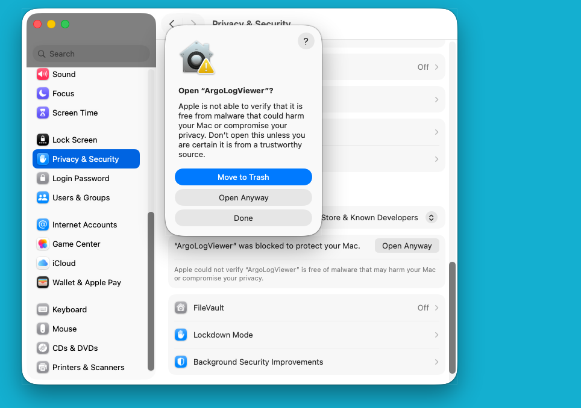
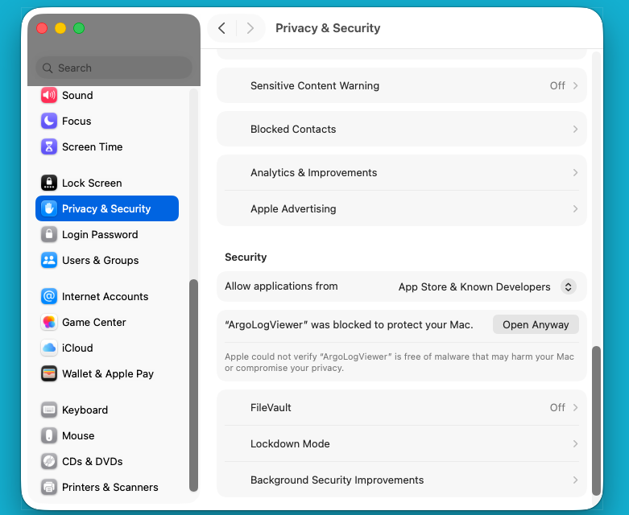

# 🍎 macOS Installation Guide - Argo Log Viewer

## ⚠️ Important: macOS Gatekeeper Security Notice

**This application is NOT code-signed or notarized by Apple.**

When you try to open ArgoLogViewer for the first time, you will see this error:

```
"ArgoLogViewer" can't be opened because Apple cannot check it for malicious software.
```

**This is NORMAL and EXPECTED.** The app is safe to use, but requires extra steps to open because it's not signed with an Apple Developer certificate (which costs $99/year).

---

## 📥 Download the Right Version

### Which Mac do I have?

1. Click the **Apple menu ()** → **"About This Mac"**
2. Look for:
   - **Intel Mac**: Shows "Processor: Intel Core i5/i7/i9"
   - **Apple Silicon**: Shows "Chip: Apple M1/M2/M3/M4"

### Download Files

| Mac Type | Download (Recommended) | Alternative |
|----------|------------------------|-------------|
| 🚀 **Apple Silicon (M1/M2/M3/M4)** | `ArgoLogViewer-vX.X.X-macOS-AppleSilicon.dmg` | `.zip` version |
| 💻 **Intel Macs** | `ArgoLogViewer-vX.X.X-macOS-Intel.dmg` | `.zip` version |

> **Note:** Intel builds may be uploaded manually after the initial release. Check back if not available yet, or use the Apple Silicon version (works via Rosetta 2).

---

## 🔓 Installation Methods

Choose **ONE** of these methods:

### ⭐ Method 1: System Settings Override (RECOMMENDED for macOS 13+)

**This is the EASIEST and MOST RELIABLE method for modern macOS versions (Ventura, Sonoma, Sequoia).**

**Step 1:** Install the DMG
1. Download the correct DMG file for your Mac
2. Double-click the DMG to open it
3. Drag "ArgoLogViewer" to the **Applications** folder
4. Eject the DMG

**Step 2:** Try to open the app (you'll see an error - this is expected!)
1. Go to **Applications** folder
2. Double-click **ArgoLogViewer**
3. You'll see this error dialog:


> *"ArgoLogViewer" can't be opened because Apple cannot check it for malicious software.*

4. Click **"Done"** or **"OK"** to dismiss the error

**Step 3:** Open System Settings and allow the app
1. Open **System Settings** (or System Preferences on older macOS)
2. Go to **Privacy & Security**
3. Scroll down to the **Security** section (bottom half of the page)
4. You should see: **"ArgoLogViewer" was blocked to protect your Mac.** with an **"Open Anyway"** button next to it



5. Click **"Open Anyway"**
6. A confirmation dialog will appear → Click **"Open"** again
7. ✅ **Done!** The app will now open normally every time

**Why this works:** This method creates a permanent security exception in macOS for this specific app.

**💡 Tip:** If you don't see the "Open Anyway" button, try right-clicking the app and selecting "Open" (Method 2 below).

---

### Method 2: Right-Click to Open (Alternative) ⚙️

**Step 1:** Install the DMG
1. Download the correct DMG file for your Mac
2. Double-click the DMG to open it
3. Drag "ArgoLogViewer" to the **Applications** folder
4. Eject the DMG

**Step 2:** Bypass Gatekeeper
1. Go to **Applications** folder
2. Find **ArgoLogViewer**
3. **Right-click (or Ctrl+Click)** the app → Select **"Open"**
4. A new dialog appears → Click **"Open"** again
5. ✅ Done! The app will now open normally every time

**Why this works:** Right-clicking tells macOS you trust this specific app.

**⚠️ Note:** On macOS Sequoia (15.x), this method may not work. If right-clicking doesn't work, use Method 1 (System Settings) or Method 3 (Terminal) instead.

---

### Method 3: Terminal Command (For Advanced Users) 🖥️

**Step 1:** Install the DMG or ZIP
- **DMG:** Open it, drag to Applications, eject
- **ZIP:** Unzip it, move `ArgoLogViewer.app` to Applications

**Step 2:** Remove Quarantine Flag
Open **Terminal** and run:

```bash
xattr -cr /Applications/ArgoLogViewer.app
```

**Step 3:** Open the app
- Double-click **ArgoLogViewer** in Applications
- If it still shows an error, use Method 1 (System Settings) or right-click → "Open"
- ✅ It should open without errors

**Why this works:** This removes the "quarantine" flag macOS adds to downloaded files.

**Additional fix for macOS Sequoia (15.x):** If the above doesn't work, also run:

```bash
sudo codesign --remove-signature /Applications/ArgoLogViewer.app/Contents/MacOS/ArgoLogViewer
sudo codesign -s - --deep --force /Applications/ArgoLogViewer.app
```

---

## ✅ Compatibility

| macOS Version | Compatible? |
|---------------|-------------|
| macOS 15.0 Sequoia | ✅ |
| macOS 14.0 Sonoma | ✅ |
| macOS 13.0 Ventura | ✅ |
| macOS 12.0 Monterey | ✅ |
| macOS 11.0 Big Sur | ✅ |
| macOS 10.15 Catalina or older | ❌ Not supported |

---

## 🛡️ Is This Safe?

**Yes!** Here's why:

✅ **Open Source**: The full source code is available on GitHub  
✅ **Checksums Provided**: Verify the download hasn't been tampered with  
✅ **No Malware**: The app doesn't contain viruses or malicious code  
✅ **Read-Only Operations**: Only views logs, doesn't modify anything  

**The issue is:** This app is **not code-signed** because:
- Apple Developer certificates cost **$99/year**
- This is a **free, open-source project**
- Many free macOS apps are distributed this way

---

## 🔐 Verify Your Download (Optional)

To ensure your download hasn't been tampered with:

**Step 1:** Download `CHECKSUMS.txt` from the release

**Step 2:** Calculate the SHA-256 hash of your download:

```bash
# For DMG files
shasum -a 256 ~/Downloads/ArgoLogViewer-vX.X.X-macOS-*.dmg

# For ZIP files
shasum -a 256 ~/Downloads/ArgoLogViewer-vX.X.X-macOS-*.zip
```

**Step 3:** Compare the output with the hash in `CHECKSUMS.txt`

✅ If they match → Your download is authentic and unmodified  
❌ If they don't match → Re-download the file

---

## 🐛 Troubleshooting

### Problem: "App is damaged and can't be opened"

**Solution:**
```bash
xattr -cr /Applications/ArgoLogViewer.app
```

Then right-click → Open.

---

### Problem: App opens briefly then closes immediately

This was an issue with older builds. **Download the latest version** - it's been fixed in the build process.

If you still have issues:
```bash
# Check if the app is properly signed
codesign -dvvv /Applications/ArgoLogViewer.app 2>&1 | grep "Signature"
```

Should show `Signature=adhoc`. If not, re-download the latest release.

---

## 📖 Why Does macOS Block This?

**Gatekeeper** is Apple's security system that:
- Blocks apps not signed with an Apple Developer certificate
- Requires apps to be "notarized" (submitted to Apple for scanning)

**To distribute apps without this error, developers must:**
1. Pay $99/year for Apple Developer Program
2. Sign the app with a certificate
3. Submit the app to Apple for notarization (48-72 hours)
4. Resubmit every time there's an update

**For free, open-source projects**, this is often not feasible.

---

## 🆘 Still Need Help?

1. **Check the logs**: `~/Library/Logs/` or Console.app
2. **GitHub Issues**: [Report a problem](https://github.com/YOUR_REPO/issues)
3. **Email**: harshmeetsingh010@gmail.com

---

## 🚀 After Installation

Once the app opens successfully:

1. **Connect to SSH**: Click "Connect" button
2. **Search Pods**: Enter a keyword and click "Fetch Pods"
3. **View Logs**: Double-click any pod to stream logs

For full usage instructions, see the [README](README.md) or [Features Guide](MD/FEATURES_GUIDE.md).

---

**Made with ❤️ by Harshmeet Singh**  
**License**: See [LICENSE.txt](LICENSE.txt)
